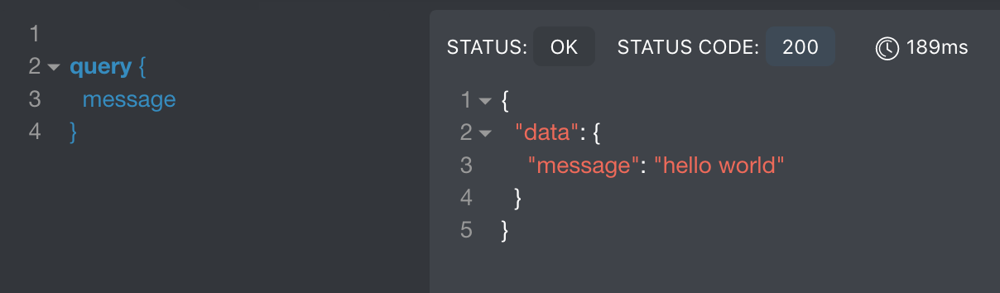
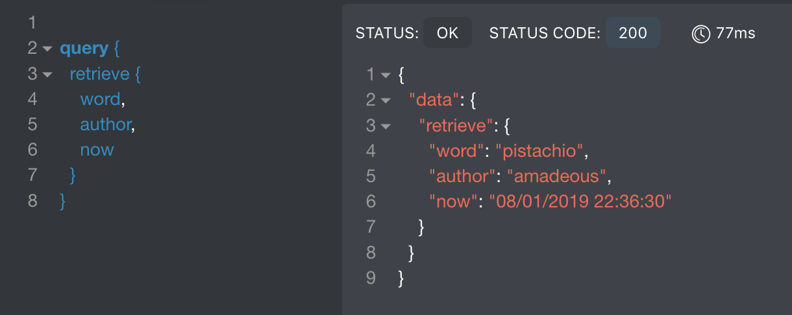
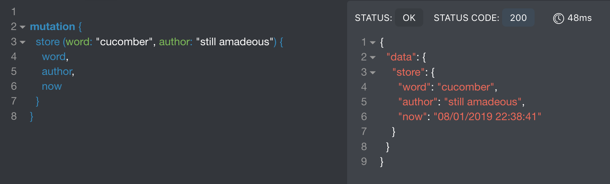

# Template for GraphQL with Apollo Server

This project aims to provide a start project for [Apollo server](https://www.apollographql.com/).

## Install

Download the project

```
git clone https://github.com/amadeous/graphql-apollo-server
```

Go in the folder

```
cd graphql-apollo-server
```

Install dependencies

```
yarn install
```

Run

```
yarn start
```

You can now access your GraphQL server at [http://localhost:4000](http://localhost:4000).

## Availables GraphQL commands

To test your GraphQL server, I recommend the [Altair pluggin](https://github.com/imolorhe/altair) for Firefox. (Yes you can set dark mode: Click on the gear wheel on upper right > Settings > Change theme to dark)

You can ask the following queries:

* message
	
* retrieve
	

And the following mutation:

* store(word: "a word", author: "an author")
	

You will notice that here the storage is simply done in a variable but you can user whatever you want (file, database,...).